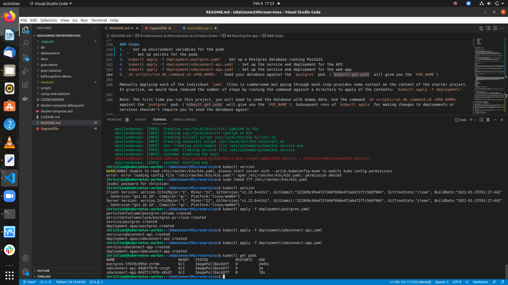

# UdaConnect
## Overview
### Background
Conferences and conventions are hotspots for making connections. Professionals in attendance often share the same interests and can make valuable business and personal connections with one another. At the same time, these events draw a large crowd and it's often hard to make these connections in the midst of all of these events' excitement and energy. To help attendees make connections, we are building the infrastructure for a service that can inform attendees if they have attended the same booths and presentations at an event.

### Planning message passing strategies 
From studying the source code of the Udaconnect application we derived a dependency graph of three services : connection service, location service and person service. The connection service depends on the two others while location service requests the verification of the person's account so as to keep his/her longitude and latitude and stores this data into the database. This is why we shall break the location service into two location microservices where the former connects with the mobile phones and the latter links with the database. The front end web application of the system links solely to the connection service which each instance provides to the rest of the world attendees information. We are therefore going to use the three message passing techniques : gRPC, REST and kafka message queues.

### Diagram of the microservices architecture
 

### Justifying each strategy 
 
The message passing techniques we will use are gRPC, REST, and Kafka message queues. The purpose is to keep track of all possible GPS information sent by mobile phones of each participant or person. Since a single person is meant to be as mobile as possible, retrieving these locations by user ID can be cumbersome and slow to manage by a REST API. So we will need a Kafka queue between the two location microservices where one will receive the three input values ​​i.e. longitude, latitude and user id as a gRPC message from each user's mobile phone, while the second will consume each produced stream as a record and store each record one after another in the udaconnect_location.sql database. The Connection Service interacts via a REST API with the Frontend of the application. The Person microservice is another REST API service that keeps track of user information. Whenever the entry point location microservice receives a gRPC message regarding a participant's location, a REST request should be made to the Person service to check if the person belongs the system.

### Screenshots of the pod and services deployments 
 

 
