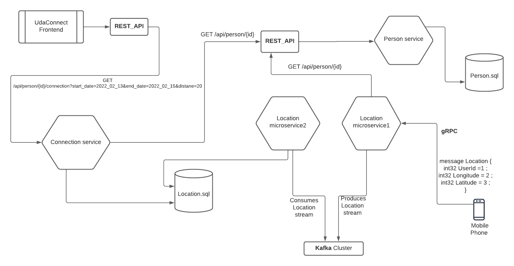
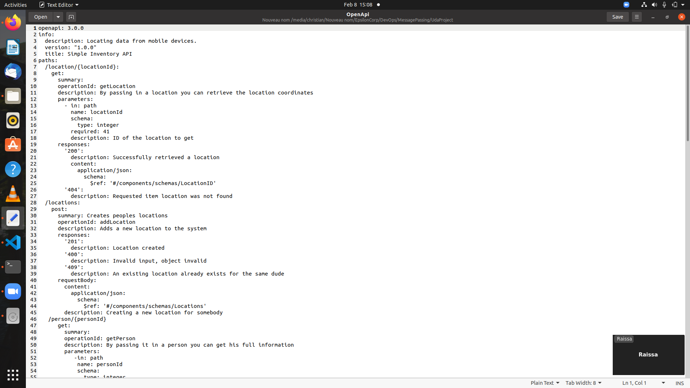
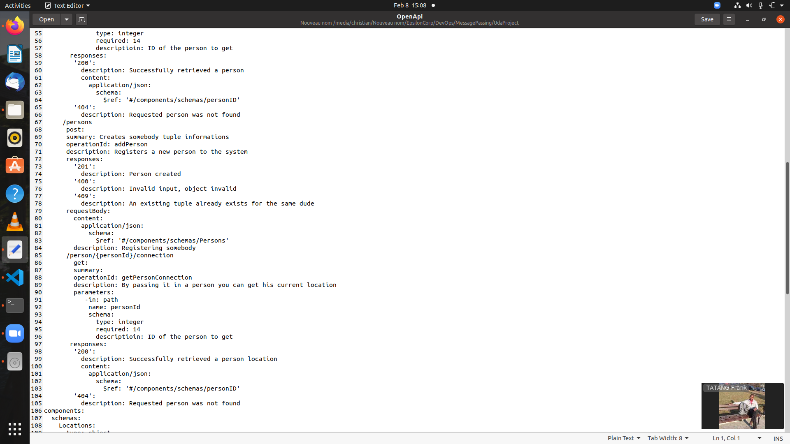
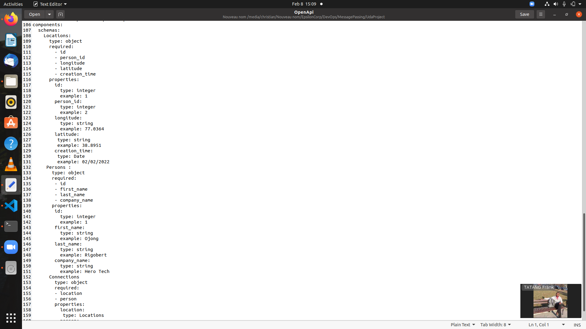
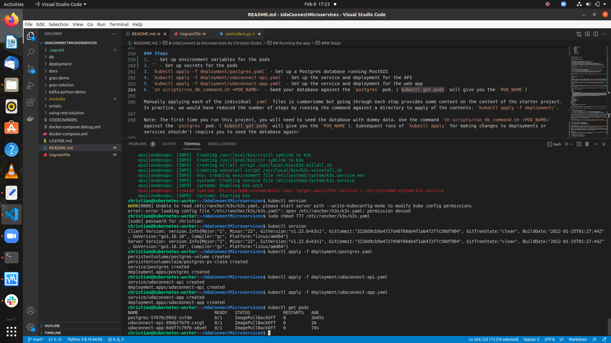
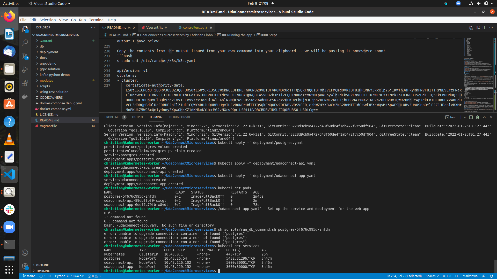
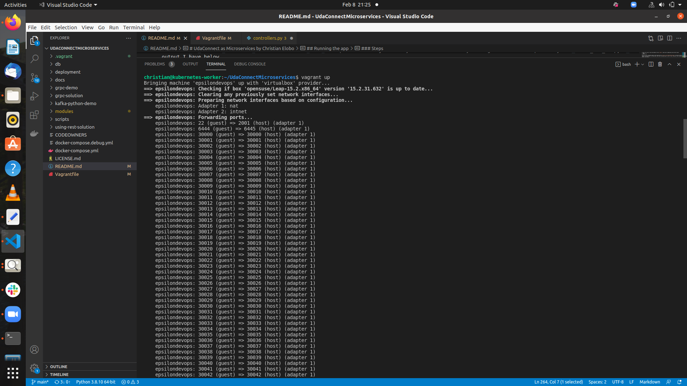

# UdaConnectMicroservices
In this project , i will be implementing the three message passing techniques (REST, gRPC, Kafka Queues ) to convert a monolith starter project into microservices defined APIs.

## Overview
### Background
Conferences and conventions are hotspots for making connections. Professionals in attendance often share the same interests and can make valuable business and personal connections with one another. At the same time, these events draw a large crowd and it's often hard to make these connections in the midst of all of these events' excitement and energy. To help attendees make connections, we are building the infrastructure for a service that can inform attendees if they have attended the same booths and presentations at an event.

### Goal
I work for a company that is building an app that uses location data from mobile devices. My company has built a [POC](https://en.wikipedia.org/wiki/Proof_of_concept) application to ingest location data named UdaTracker. This POC was built with the core functionality of ingesting location and identifying individuals who have shared a close geographic proximity.

Management loved the POC so now that there is buy-in, we want to enhance this application. I have been tasked to enhance the POC application into a [MVP](https://en.wikipedia.org/wiki/Minimum_viable_product) to handle the large volume of location data that will be ingested.

To do so, ***I will refactor this application into a microservice architecture using message passing techniques that I have learned in this course***.These message passing techniaues are gRPC, REST and Kafka message queues.  It’s easy to get lost in the countless optimizations and changes that can be made: my priority will be to approach the task as an architect and refactor the application into microservices. File organization, code linting -

### Archictecture Diagram


### Documentation 





                

### kubectl get pods


### kubectl get services
 

### Technologies
* [Flask](https://flask.palletsprojects.com/en/1.1.x/) - API webserver
* [SQLAlchemy](https://www.sqlalchemy.org/) - Database ORM
* [PostgreSQL](https://www.postgresql.org/) - Relational database
* [PostGIS](https://postgis.net/) - Spatial plug-in for PostgreSQL enabling geographic queries]
* [Vagrant](https://www.vagrantup.com/) - Tool for managing virtual deployed environments
* [VirtualBox](https://www.virtualbox.org/) - Hypervisor allowing you to run multiple operating systems
* [K3s](https://k3s.io/) - Lightweight distribution of K8s to easily develop against a local cluster

## Running the app
The project has been set up such that you should be able to have the project up and running with Kubernetes.

### Prerequisites
We will be installing the tools that we'll need to use for getting our environment set up properly.
1. [Install Docker](https://docs.docker.com/get-docker/)
2. [Set up a DockerHub account](https://hub.docker.com/)
3. [Set up `kubectl`](https://rancher.com/docs/rancher/v2.x/en/cluster-admin/cluster-access/kubectl/)
4. [Install VirtualBox](https://www.virtualbox.org/wiki/Downloads) with at least version 6.0
5. [Install Vagrant](https://www.vagrantup.com/docs/installation) with at least version 2.0

### Environment Setup
To run the application, you will need a K8s cluster running locally and to interface with it via `kubectl`. We will be using Vagrant with VirtualBox to run K3s.

#### Initialize K3s
In this project's root, run `vagrant up`. 
```bash
$ vagrant up
```
The command will take a while and will leverage VirtualBox to load an [openSUSE](https://www.opensuse.org/) OS and automatically install [K3s](https://k3s.io/). When we are taking a break from development, we can run `vagrant suspend` to conserve some ouf our system's resources and `vagrant resume` when we want to bring our resources back up. Some useful vagrant commands can be found in [this cheatsheet](https://gist.github.com/wpscholar/a49594e2e2b918f4d0c4).

 

### Steps
1. `kubectl apply -f deployment/db-configmap.yaml` - Set up environment variables for the pods
2. `kubectl apply -f deployment/db-secret.yaml` - Set up secrets for the pods
3. `kubectl apply -f deployment/postgres.yaml` - Set up a Postgres database running PostGIS
4. `kubectl apply -f deployment/udaconnect-api.yaml` - Set up the service and deployment for the API
5. `kubectl apply -f deployment/udaconnect-app.yaml` - Set up the service and deployment for the web app
6. `sh scripts/run_db_command.sh <POD_NAME>` - Seed your database against the `postgres` pod. (`kubectl get pods` will give you the `POD_NAME`)

Manually applying each of the individual `yaml` files is cumbersome but going through each step provides some context on the content of the starter project. In practice, we would have reduced the number of steps by running the command against a directory to apply of the contents: `kubectl apply -f deployment/`.

Note: The first time you run this project, you will need to seed the database with dummy data. Use the command `sh scripts/run_db_command.sh <POD_NAME>` against the `postgres` pod. (`kubectl get pods` will give you the `POD_NAME`). Subsequent runs of `kubectl apply` for making changes to deployments or services shouldn't require you to seed the database again!

### Verifying it Works
Once the project is up and running, you should be able to see 3 deployments and 3 services in Kubernetes:
`kubectl get pods` and `kubectl get services` - should both return `udaconnect-app`, `udaconnect-api`, and `postgres`
